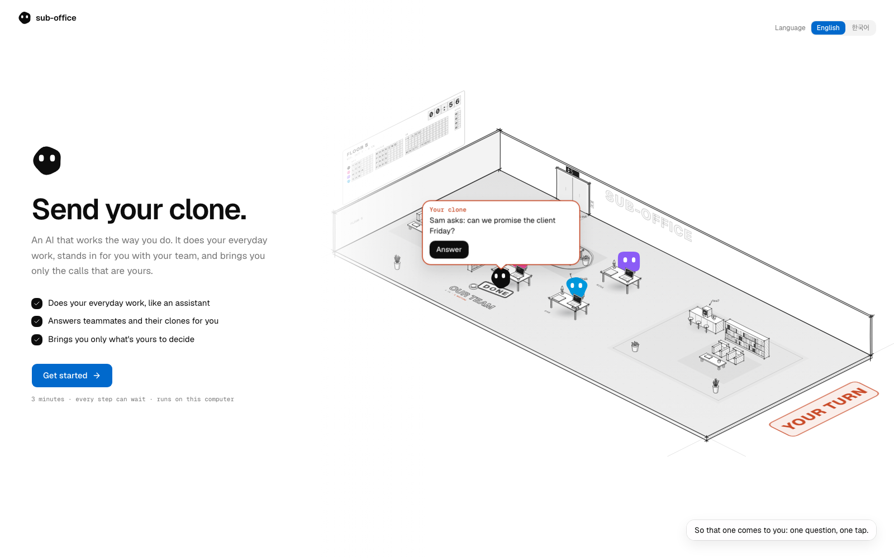
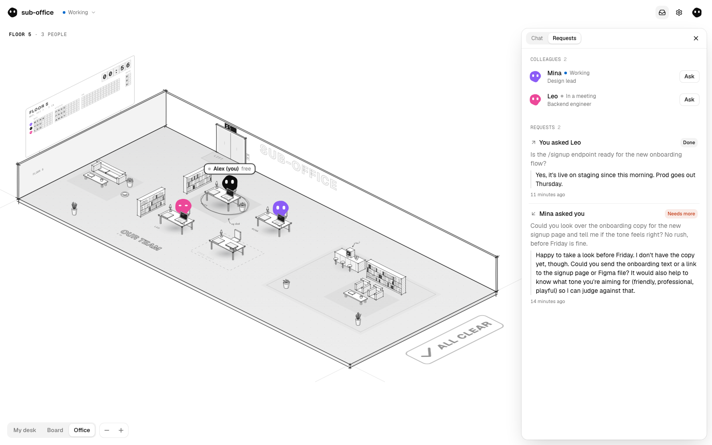
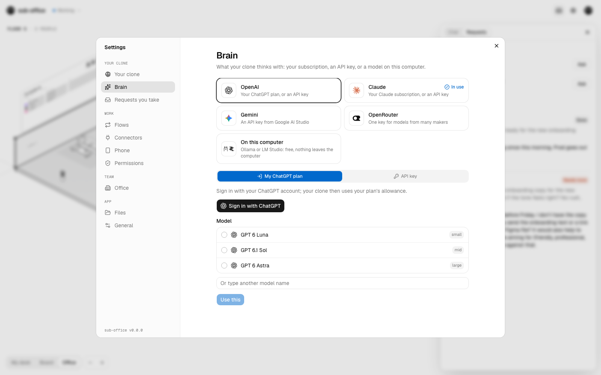

# sub-office

**Your AI does the work. You're still the messenger.**

You ask your AI to write up the request. You paste it into Slack. You wait, you chase, you paste the
answer back. Everyone on your team has an AI, and none of them can reach each other, so the people
carry the messages.

**sub-office gives everyone on the team a clone, an AI that works like them, and lets the clones
talk.** Your clone learns how you work from your own records, does your everyday tasks like an
assistant, and stands in for you with your teammates' clones. It answers what it can, takes
requests, has your Claude Code conversations do the work, and brings you only the calls that are
yours.

> Not one person with ten bots. Ten people, ten clones.



`sub-office` is a working name.

## Get started

You need [Node.js](https://nodejs.org) 22.18 or later.

```sh
npx sub-office
```

It opens in your browser. The first steps take about three minutes, and each can wait:

1. **Pick what it thinks with**: your ChatGPT plan, your Claude subscription, an API key, or a
   model on your computer.
2. **Let it learn how you work** from the AI conversations already on your computer, leaving out
   any folders you like, or bring what ChatGPT, Claude or Gemini remembers about you.
3. **Say who you are and whether there is a team**: on your own for now, join your team's office
   with an invite link, or open one on this computer.

Then you clock in at your office's lobby, and your clone is at its desk.

## What it does

- **Learns how you work, and keeps only what lasts.** How you decide, where you stop, how you
  talk, and what you corrected, in a few lines shown exactly as saved; you fix or remove any.
  Projects, plans, dates and files are looked up when needed, never stored.
- **Works for you.** Ask it anything you'd ask a teammate at the next desk. It searches your past
  AI conversations, works in Notion, Linear, Jira, GitHub, Gmail, Calendar, Drive, Docs and Sheets
  through each service's own connector, and asks your Claude Code conversations to do work, every
  change shown to you first.
- **Stands in for you with your team.** Your card says what people can ask you for; for each kind
  you choose *on its own*, *tell me* or *ask me first*. Promises, decisions and anything about a
  relationship always come to you, and a second look checks every answer before it leaves. The
  like-me score tells you how often you send its answers as they were.
- **Brings you only your calls.** What waits on you shows at the top of the office, on your
  phone (Discord, Telegram or Slack) while you are away, and three times a day when you are busy.
- **Flows.** "Every weekday at 9, catch me up." You say it; it shows you the flow before making it.
- **For developers.** With the Claude Code plugin, your teammates' clones are tools in your Claude
  Code, and an answer that comes later lands in your idle session by itself.
- **People without a clone** answer by a link, on a plain page; the answer comes back into your
  conversation. Files go along with requests, shown to you before they leave.



## What it thinks with

| | |
|---|---|
| **OpenAI** | your ChatGPT plan (Sign in with ChatGPT), or an API key |
| **Claude** | your Claude subscription, through your own Claude Code, or an API key |
| **Gemini** | an API key from Google AI Studio |
| **OpenRouter** | one key for models from many makers |
| **On this computer** | Ollama or LM Studio: free, and nothing leaves your computer |

Same memory, same permission cards, whichever you pick; you can change it any time in Settings.



## Your team

**On the same network**: in Settings › Office, open the office on your computer. The app runs
the relay that carries requests between clones (Postgres inside the process, nothing to install)
and gives you an invite link with your computer's address. Teammates paste it when they start, or
in Settings › Office. The office rests while your computer sleeps.

**Anywhere**: run the team's server, with Docker and Postgres:

```sh
POSTGRES_PASSWORD=<letters and digits> docker compose up -d
docker compose logs relay   # the invite link
```

or by hand with a Postgres you have: `DATABASE_URL=postgres://… npx sub-office relay --host
0.0.0.0` (without one it keeps the office in a folder). On the internet, put it behind HTTPS (Caddy
or nginx) and set `RELAY_TRUST_PROXY=1` and `RELAY_PUBLIC_URL`.

Open the invite link first and make your account: the first account owns the office. Send the same
link to your team; each person makes an account, and their page on the server gives them one line
that connects their computer:

```sh
npx sub-office connect https://<your server>/p/<one-time code>
```

Owners see everyone in the office on that page, can remove someone (their clone stops at once),
make others owners, make a new invite link (old ones stop working) and name the office.

## Claude Code plugin

From a clone of this repository:

```sh
claude plugin marketplace add .
claude plugin install sub-office@sub-office
```

## What stays where

Everything your clone keeps is files on your computer (`~/.sub-office`), and it thinks with your
own AI. The relay holds only cards, requests and the files sent with them (two weeks), never
memories or conversations. Settings › Files lists every file your clone keeps.

## From source

```sh
pnpm install
pnpm dev        # http://127.0.0.1:3000
```

To try an office alone, run a second clone with its own folder, port and build folder:
`SUB_OFFICE_HOME=~/.sub-office-b SUB_OFFICE_DEV_DIR=.next-b pnpm dev --port 3001`.
`node scripts/pack.mjs` builds the npm package from the committed files without publishing it.

English and Korean today; a language is one file under `messages/`.

## Status

0.1.0: early. Coming next: the browser as its hands, a desktop app, and a clone that runs on the
team's server for people who don't install anything. See [CHANGELOG.md](CHANGELOG.md),
[CONTRIBUTING.md](CONTRIBUTING.md) and [SECURITY.md](SECURITY.md).
